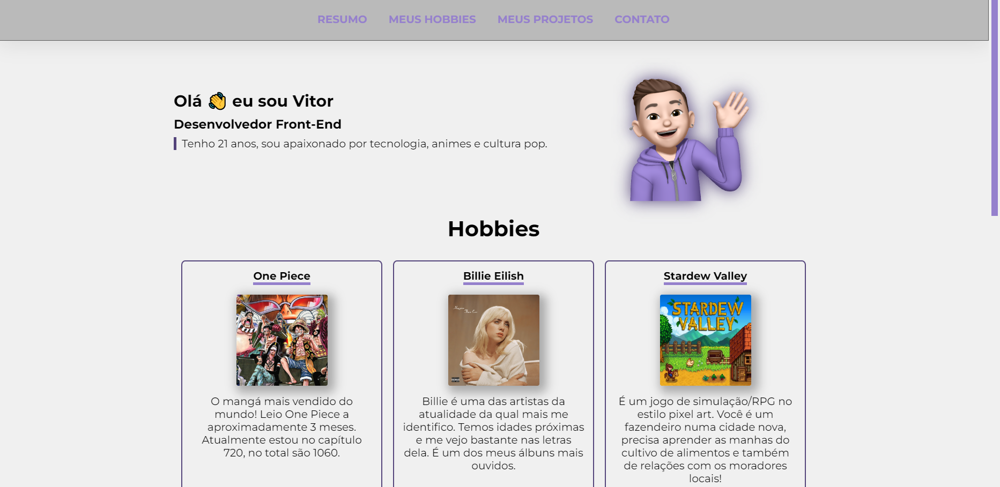
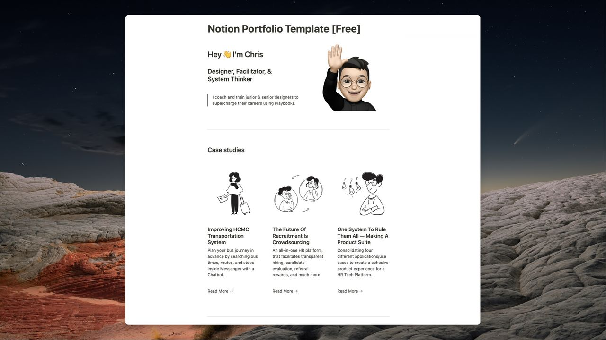

# Meu Portfolio

## Proposta do projeto

Trabalho individual do módulo 1: introdução ao front-end. Demonstrar conhecimentos sólidos adquiridos em HTML e CSS.

## Tecnologias utilizadas

HTML, CSS e JavaScript

## Demonstração da aplicação

### Referência

[UX portfolio template para Notion](https://twitter.com/semigrownkid/status/1566596533629370371?s=20&t=vGpdRz11UUzbB4IBc_XnWg)

🚨**Projeto Finalizado**🚨
